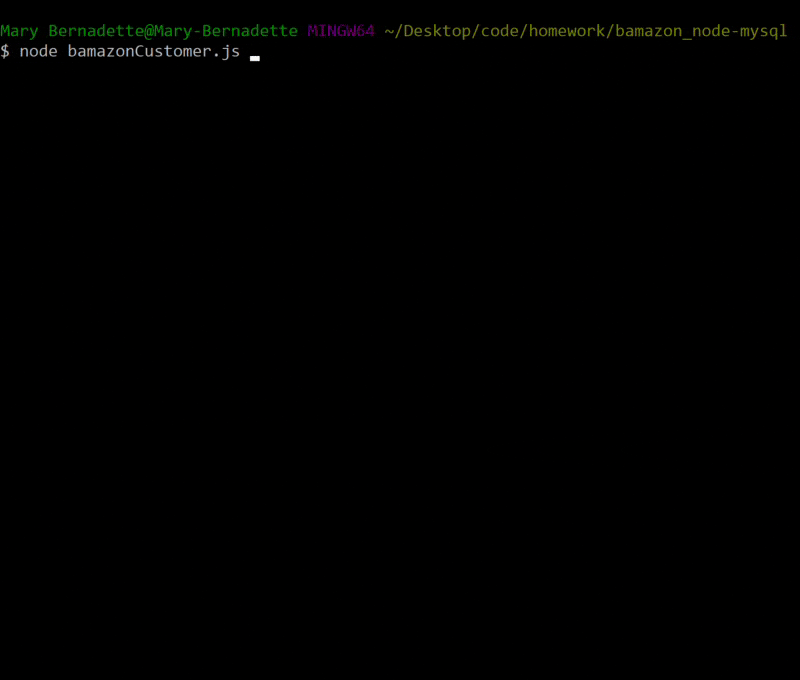

Bamazon!

Challenge 1: Customer View

1. Open command line or terminal and enter "node bamazonCustomer.js to start the app 
2. A list of available products is displayed. Where prompted, enter the item id of the product you wish to purchase. 
3. After selecting the desired product, enter the quantity you wish to purchase. 
4. If there is sufficient quantity in stock, the app will update inventory in the database and calculate your order total. 

5. If selected quantity is greater than available inventory, you will be notified of insufficient stock and prompted to begin your search again.
